# ZVault

**Encrypted environment variable manager. Local-first, offline, no accounts.**

ZVault is a desktop application for developers who are tired of losing track of which secret goes where. Every variable is encrypted with AES-256-GCM before it touches disk. The encryption key lives in memory only — and is zeroed when you lock.

Built with Tauri v2 + Rust backend, React 18 frontend.

---

## Features

- **AES-256-GCM encryption** — each variable value encrypted individually with a unique random nonce
- **Argon2id key derivation** — 64 MB memory, 5 iterations, 4 threads; brute force is expensive by design
- **Project → Environment → Variable hierarchy** — organize secrets by project and stage (dev, staging, prod)
- **Live .env file sync** — link any environment to a file on disk; import with a visual diff preview
- **Auto-lock** — configurable timer (1m / 5m / 15m / 30m / never); DEK zeroed on every lock; optional status bar countdown (amber at ≤5 min, red at ≤60 s)
- **Audit log** — every reveal, copy, import, export, lock, and unlock recorded; filterable by type with date grouping
- **Recovery code** — reset your master password without losing any data
- **Command palette** — `Ctrl+K` quick-access to all actions
- **Bulk operations** — select multiple variables to delete or manage at once
- **100% offline** — no network requests, no accounts, no telemetry, no cloud

---

## Download

**[→ Pre-built download at zsync.eu/zvault/](https://zsync.eu/zvault/)**

Also available as MSI installer and portable `.exe`.

Requires Windows 10/11 x64.

---

## Screenshots

<div align="center">

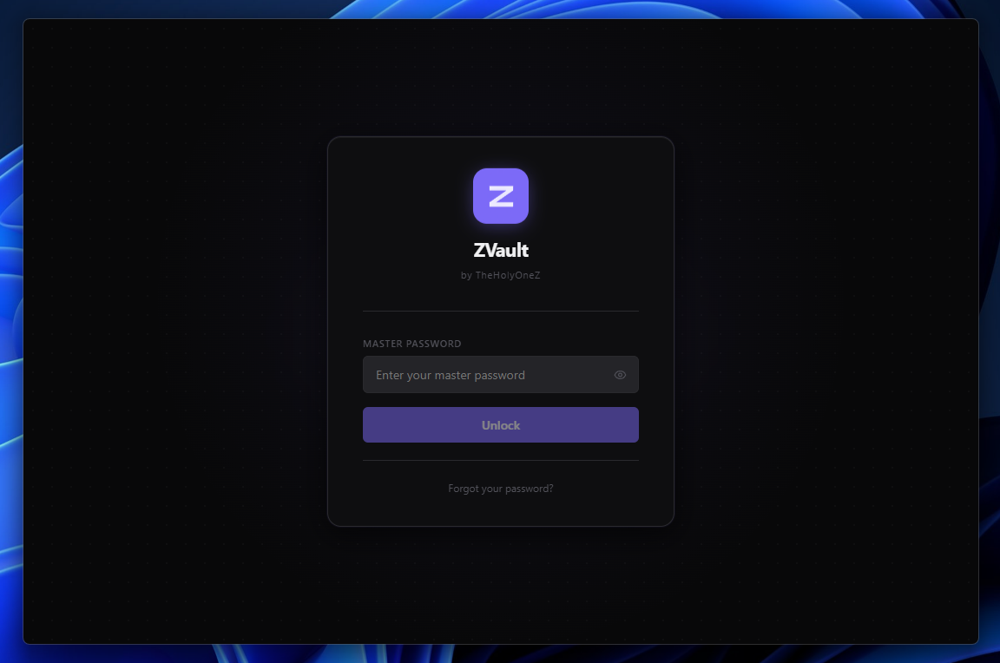

<br><br>

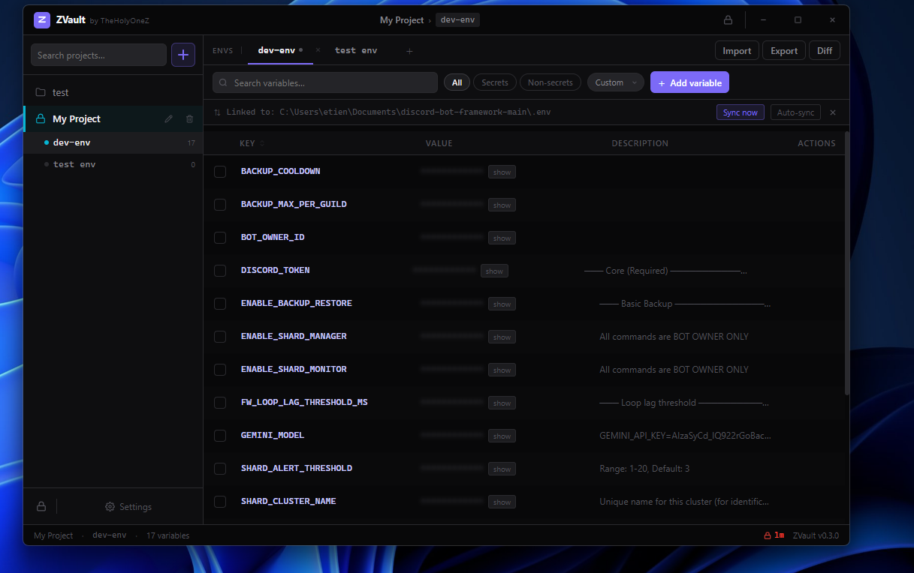

<br><br>

<table>
<tr>
<td>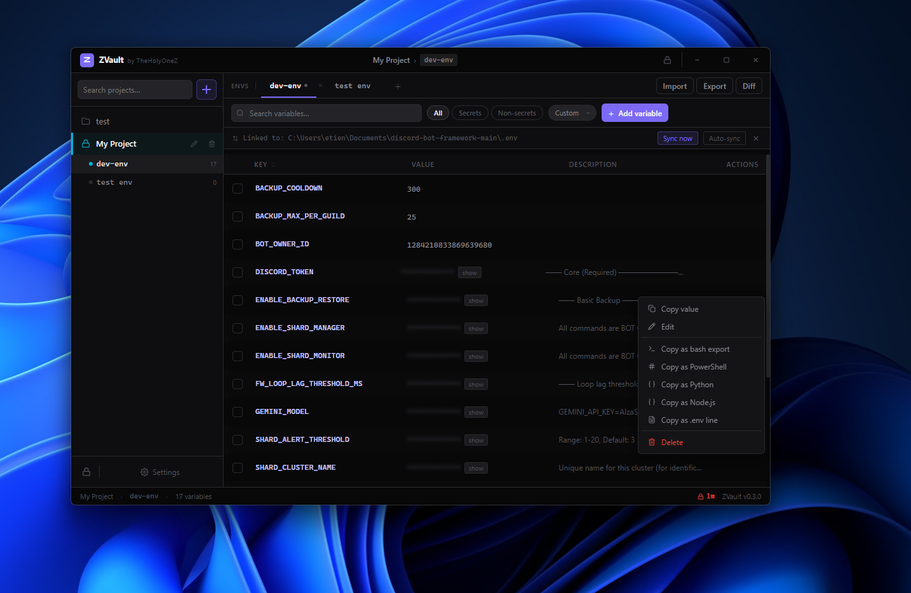</td>
<td>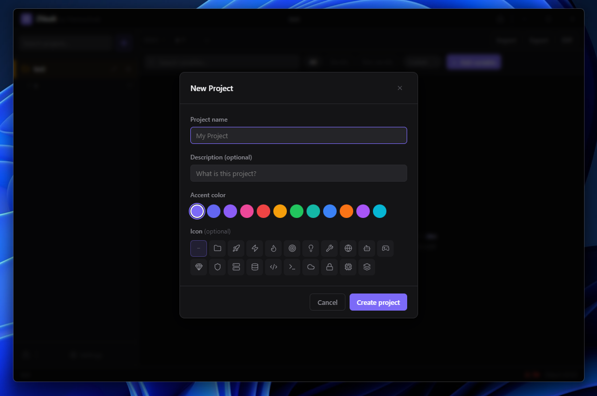</td>
</tr>
<tr>
<td>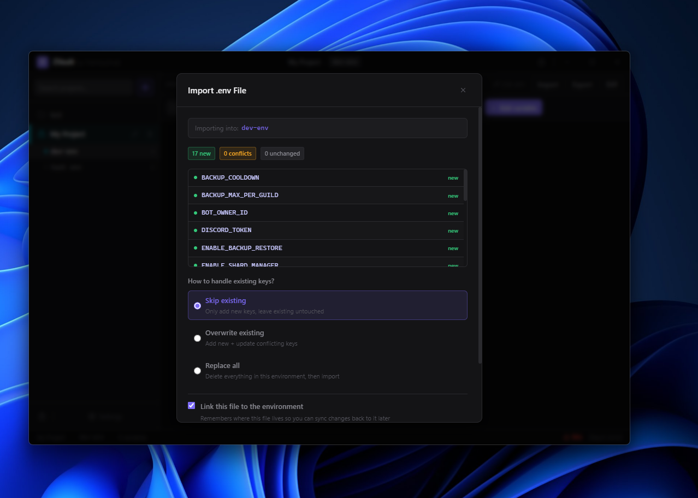</td>
<td>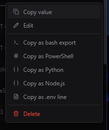</td>
</tr>
<tr>
<td>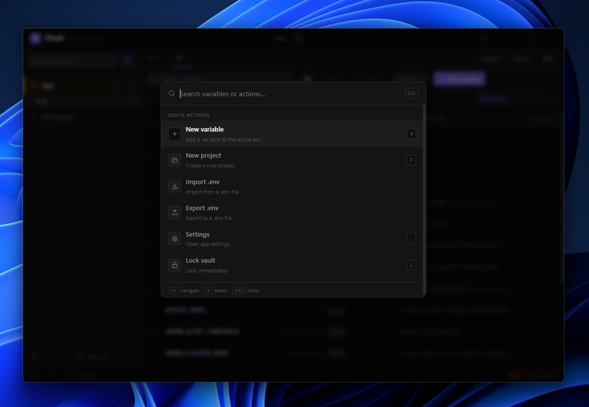</td>
<td>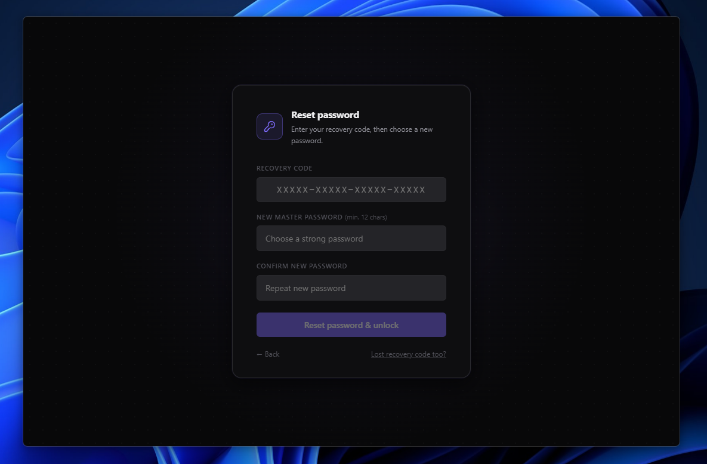</td>
</tr>
</table>

**Settings**

<table>
<tr>
<td>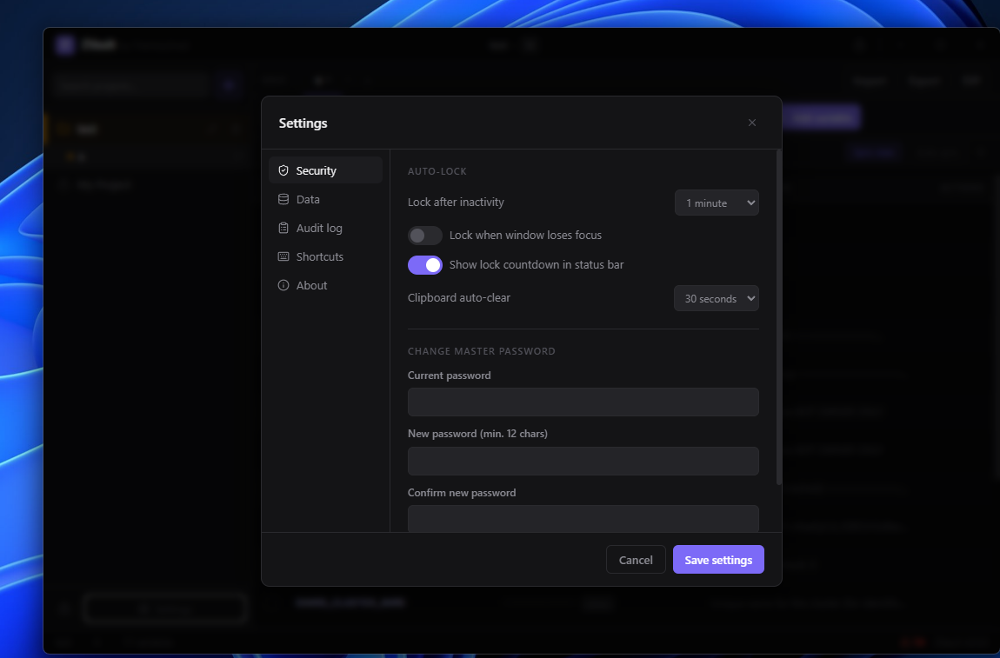</td>
<td>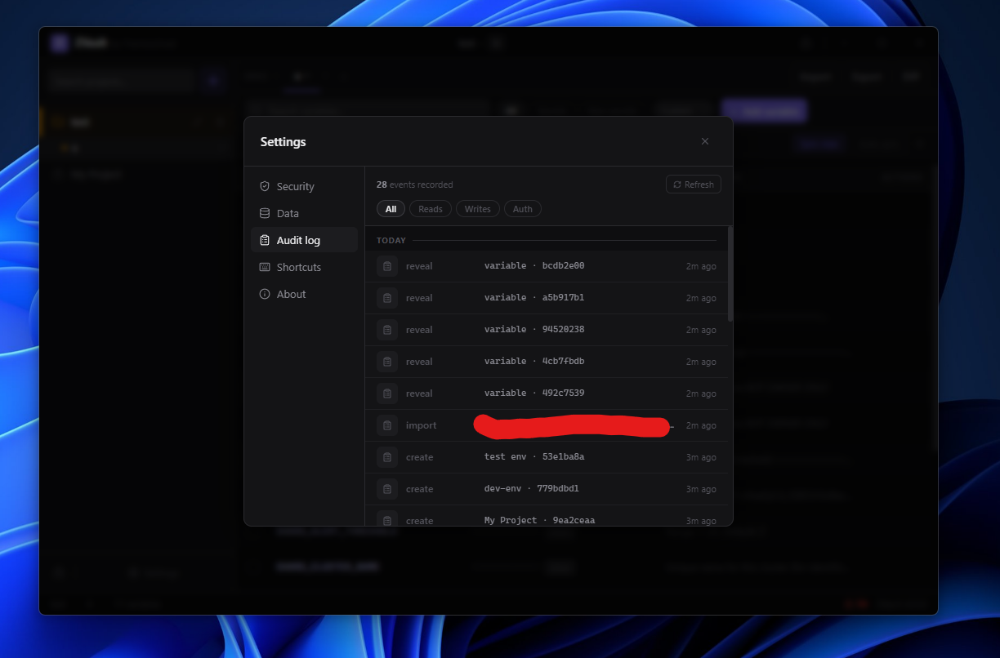</td>
<td>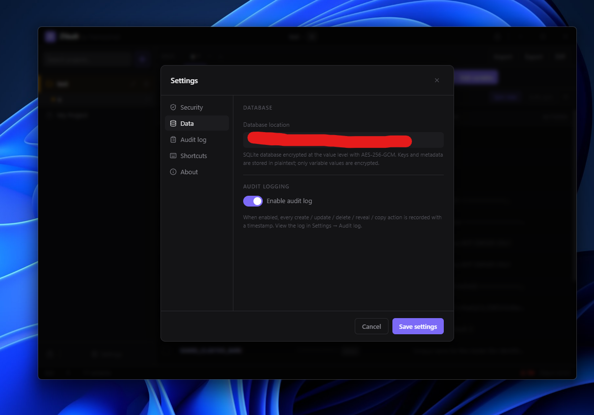</td>
<td>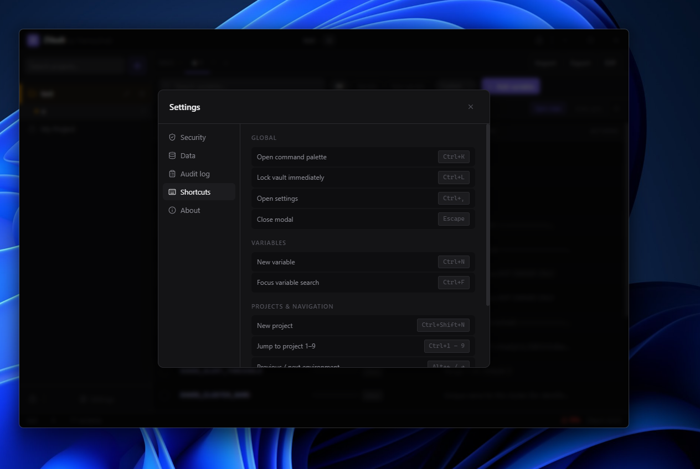</td>
</tr>
</table>


</div>

---

## Security design

| Component | Choice | Reason |
|-----------|--------|--------|
| Encryption | AES-256-GCM | Authenticated encryption; each value gets a unique 96-bit nonce |
| Key derivation | Argon2id | Memory-hard; winner of Password Hashing Competition |
| KDF parameters | 64 MB memory, 5 iterations, 4 threads | OWASP-recommended minimum for Argon2id (upgraded from 3 in v0.3.0) |
| KDF params stored per-vault | `argon2_t_cost` in DB | Allows future upgrades without breaking existing vaults |
| Key storage | `Zeroizing<[u8;32]>` (zeroize crate) | Zeroed on drop, never serialized |
| Plaintext intermediates | `Zeroizing<String>` during re-encryption | Secret values overwritten in RAM immediately after use |
| On lock | `dek.zeroize()` | Overwrites memory byte-by-byte, not just freed |
| Verify blob comparison | `subtle::ConstantTimeEq` | Constant-time; no timing side-channel on password verification |
| Recovery code | 30 chars (6×5) from 32-symbol alphabet | ~150 bits entropy; above 128-bit offline-attack threshold |
| Database | SQLite (local) | Single file, no server, no network |
| Only values encrypted | Keys and descriptions are plaintext | Acceptable trade-off; only secrets need protection |

The master password is never stored. A verification blob (AES-GCM of a known constant, compared in constant time) is stored so the app can confirm an unlock attempt is correct without persisting the password or key.

---

## Building from source

**Prerequisites:** Rust (stable), Node.js 18+, npm

```bash
git clone https://github.com/TheHolyOneZ/ZEnvVault
cd ZEnvVault

# Install frontend dependencies
npm install

# Development (hot reload)
npm run tauri dev

# Production build + installer
npm run tauri build
```

Output: `src-tauri/target/release/bundle/`
- `nsis/ZVault_0.3.0_x64-setup.exe` — NSIS installer
- `msi/ZVault_0.3.0_x64_en-US.msi` — MSI installer

---

## Keyboard shortcuts

| Shortcut | Action |
|----------|--------|
| `Ctrl+K` | Command palette |
| `Ctrl+L` | Lock vault immediately |
| `Ctrl+,` | Settings |
| `Ctrl+N` | New variable |
| `Ctrl+Shift+N` | New project |
| `Ctrl+F` | Focus variable search |
| `Ctrl+I` | Import .env file |
| `Ctrl+E` | Export current environment |
| `Ctrl+1–9` | Jump to project 1–9 |
| `Alt+← / →` | Previous / next environment |
| `Escape` | Close modal |

---

## Tech stack

| Layer | Technology |
|-------|-----------|
| Desktop framework | Tauri v2 |
| Backend | Rust |
| Frontend | React 18 + TypeScript |
| State | Zustand |
| Database | SQLite via sqlx |
| Encryption | aes-gcm 0.10 |
| Key derivation | argon2 0.5 |
| Memory safety | secrecy + zeroize |
| Icons | Lucide React |

---

## Data location

```
%APPDATA%\ZVault\zvault.db
```

Single encrypted SQLite file. Back it up like any other file.

---

## Links

- **Project:** [github.com/TheHolyOneZ/ZEnvVault](https://github.com/TheHolyOneZ/ZEnvVault)
- **Author:** [github.com/TheHolyOneZ](https://github.com/TheHolyOneZ)
- **More projects:** [zsync.eu](https://zsync.eu)

---

## License

MIT — see [LICENSE](LICENSE) for details.
